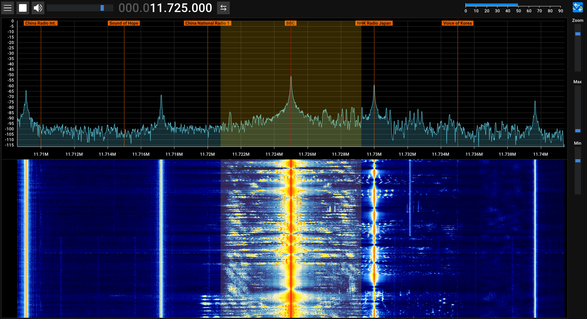

# Shortwave Station List SDR++
A plugin for SDR++ to display stations from shortwave-station-list



You can find the repository for the database [here](https://github.com/OttoPattemore/shortwave-station-list).

## Setup
### Linux
Currently this is a little tricky but it is do-able.


Dependencies:
```bash
sudo apt install libcurl4-openssl-dev
```

You will need to have compiled SDR++ from source to compile the plugin.  Once you have done that point cmake to the SDR++ code.
```bash
sh create_link.sh <path to your SDR++ source>/core/
```

Next build the project:
```bash
mkdir build
cd build
cmake ..
make -j8
```

Now that we have build the plugin we need to point SDR++ to it.
Go to your installation of SDR++'s root directory.  Open the ``config.json`` file and find the module list. It should look something like this:
```json
    "modules": [
        "./build/source_modules/plutosdr_source/plutosdr_source.so",
        .....
        "./build/misc_modules/recorder/recorder.so"
    ],
```
After the last module on the list add the path of the plugin you just compiled.
```json
    "modules": [
        "./build/source_modules/plutosdr_source/plutosdr_source.so",
        .....
        "./build/misc_modules/recorder/recorder.so",
        "<Path to the plugins build directory>/src/libshortwave_station_list_sdrpp.so"
    ],
```
Start SDR++, the plugin should now be installed.

### Windows
TODO